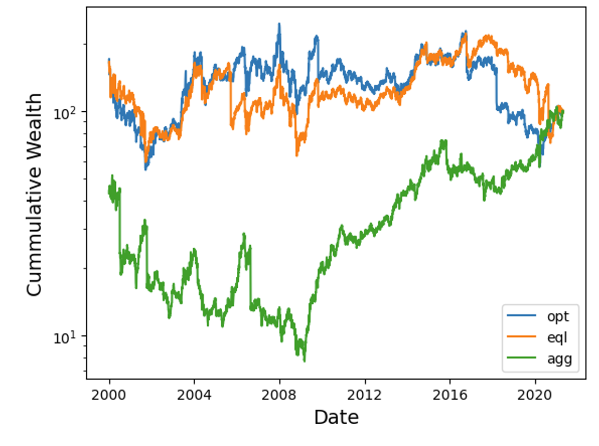

# MPF Portfolio Optimization (Convex Optimization)
[](https://www.python.org/)
[](https://www.cvxpy.org/)
[](https://jupyter.org/)
[](LICENSE)


A compact, reproducible project that formulates **portfolio construction as convex programs**—balancing return and risk with QP/QCQP—implemented in Python with CVXPY. Designed to be technically useful for replication.

---

## What’s in this repo
- **Report:** `Convex_Optimization.pdf` – full write-up, methods, results, references.  
- **Slides:** `Convex Optimisation.pptx` – talk-track version of the project.  
- **Notebook:** `convex-optimization.ipynb` – runnable code for data prep, optimization, and plots.

> **Course project:** *Convex Optimisation (MA60213)*<br>
> **Institution:** IIT Kharagpur<br>
> **Authors:** Mihir Mallick (21CS30031), Aatir Zaki (21CH10092)<br>
> **Supervisor:** Prof. Swanand Khare<br>
> **Submitted:** Nov 14, 2024


---

- **Problem**: Long-only portfolio selection under a **return–risk** trade-off.
- **Method**: Two convex formulations  
  1) **Maximize expected return** s.t. variance ≤ σ²_max (**QCQP**)  
  2) **Minimize variance** s.t. expected return ≥ r_min (**QP**)
- **We also derive & visualize the** **efficient (Pareto) frontier** from these formulations.
- **Stack**: `python`, `numpy`, `pandas`, `cvxpy`, `matplotlib`.
- **Outcomes**: Efficient-frontier analysis; optimal allocation and **risk ≈ 4.456%**; comparison vs equal-weight and concentrated strategies.
- **Takeaways**: Clear trade-offs; standard MPT caveats (variance as risk, historical estimation).

---

## Efficient (Pareto) Frontier
The **efficient frontier** is the set of Pareto-optimal portfolios: for a given risk, no other portfolio offers higher expected return, and for a given expected return, none has lower risk.

We generate it by sweeping a return floor and solving the **min-variance QP** repeatedly:

```python
# In a Python shell or a cell, once data is loaded:
from src.data import load_prices, impute_prices, to_returns, mean_cov
from src.optimize import efficient_frontier
from src.plots import plot_efficient_frontier
import matplotlib.pyplot as plt

# Example with the taken CSV:
# prices = load_prices("data/prices.csv", date_col="Date")
# prices = impute_prices(prices, k=5)
# rets = to_returns(prices)
# mu, S = mean_cov(rets)

# For a quick demo without data, you can still run the notebook.

frontier = efficient_frontier(mu, S, n_pts=50)
ax = plot_efficient_frontier(frontier)
plt.savefig("figs/efficient_frontier.png", dpi=200, bbox_inches="tight")
```





---

## Dataset (summary)
- **Universe**: 15 assets, **daily closing prices (2000–2021)**.  
- **Sourcing**: Subset from a larger **Kaggle** dataset (>25 assets).  
- **Cleaning**: Dropped non-essential features (open/high/volume); filled occasional gaps with a **KNN-style local mean (k=5)**.  
- **Assumptions**: Long-only (**w ≥ 0**), fully invested (**1ᵀw = 1**).  
- **Objectives**: Return maximization under a risk cap; risk minimization under a return floor.

> Note: This is a pedagogy/demo project—not investment advice.

---

## Results (high-level)
- **Optimal risk ≈ 4.456%** under the chosen constraints.  
- **Comparative study**: Optimal vs **equal-weight** vs **aggressive** (concentrated) allocations—optimal wins on cumulative wealth.  
- **Frontier intuition**: Efficient trade-offs consistent with **Markowitz (MPT)**.

---

## How to run
1. **Clone** the repo and navigate into it.
2. Create a virtual environment:
   ```bash
   python -m venv .venv
   source .venv/bin/activate  # Windows: .venv\Scripts\activate
   ```
3. Install packages:
   ```bash
   pip install -r requirements.txt
   ```
4. Run the notebook:
   ```bash
   jupyter notebook convex-optimization.ipynb
   ```
…or use the small src/ API:
   ```bash
   python -c "from src.data import load_prices, to_returns, mean_cov; \
           from src.optimize import solve_min_variance; \
           import numpy as np; import pandas as pd; \
           # Example: synthetic demo
           import numpy as np; rng=np.random.default_rng(0); \
           prices=pd.DataFrame(rng.lognormal(0.0003, 0.01, size=(500,5))).cumprod(); \
           rets=to_returns(prices); mu,S=mean_cov(rets); \
           w=solve_min_variance(mu,S,r_min=mu.mean()); print('weights=',w)"
   ```


## References & links
- Report & slides in this repo.
- Boyd & Vandenberghe, Convex Optimization (2004).
- Markowitz, Portfolio Selection (1952).


